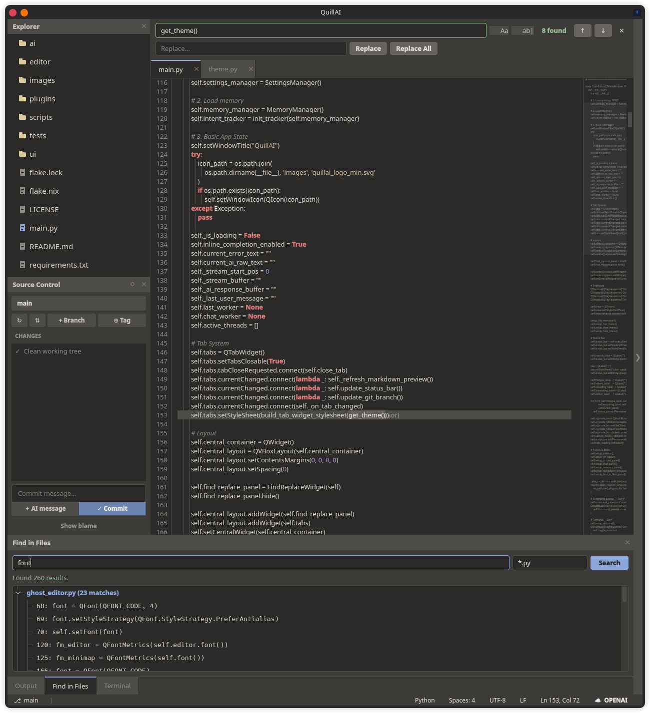
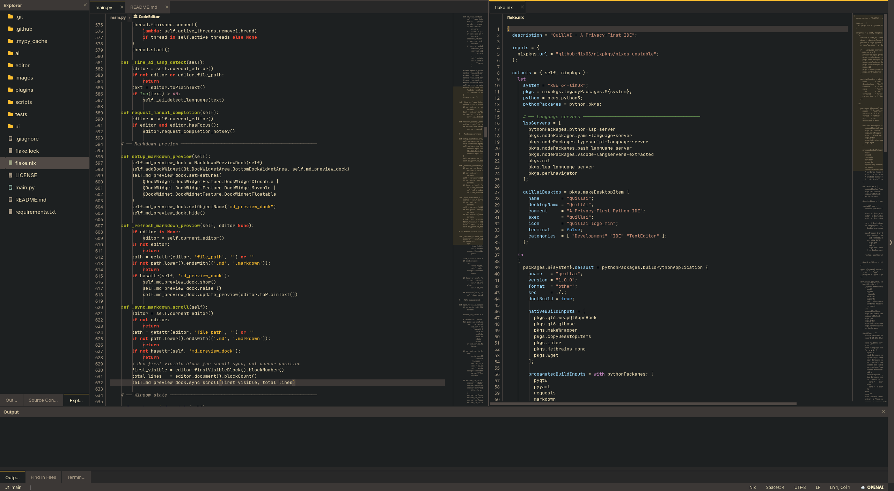
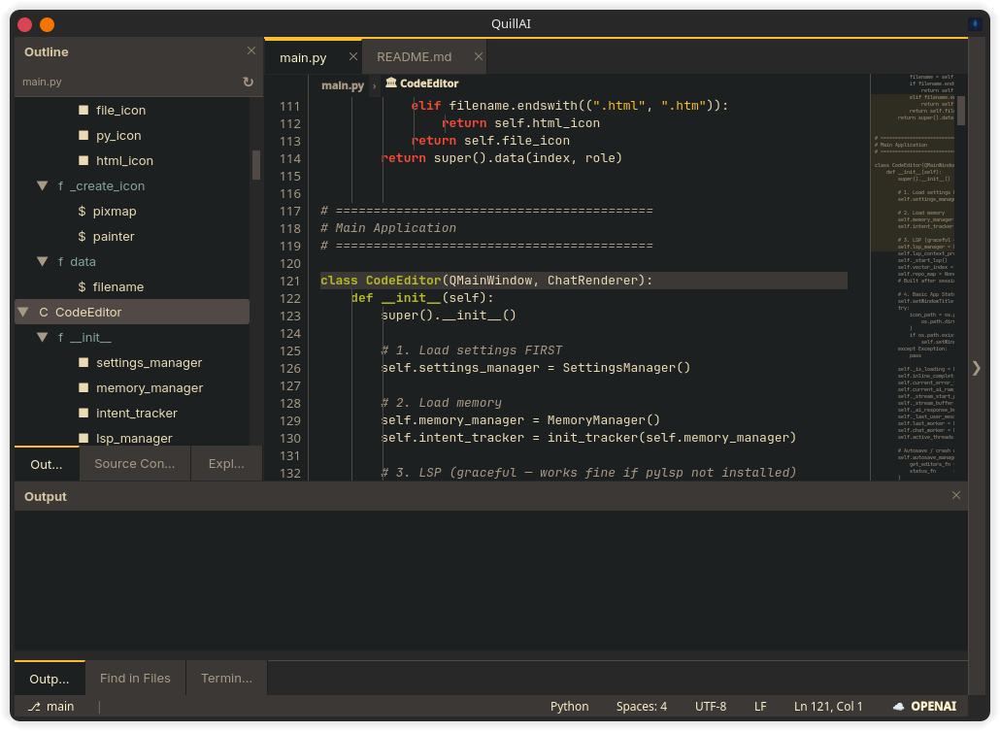
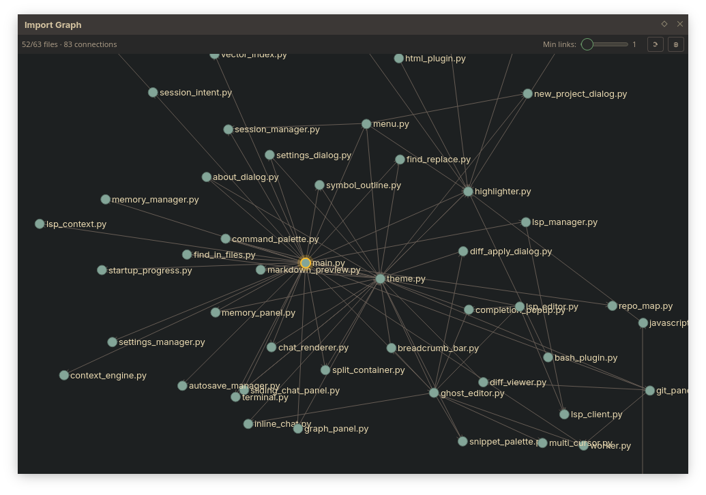
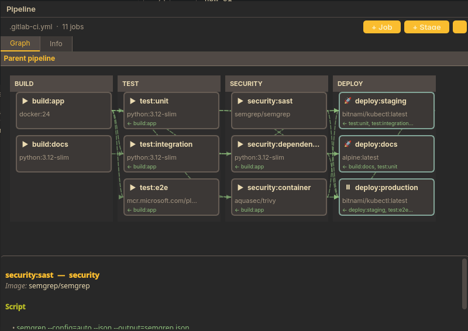
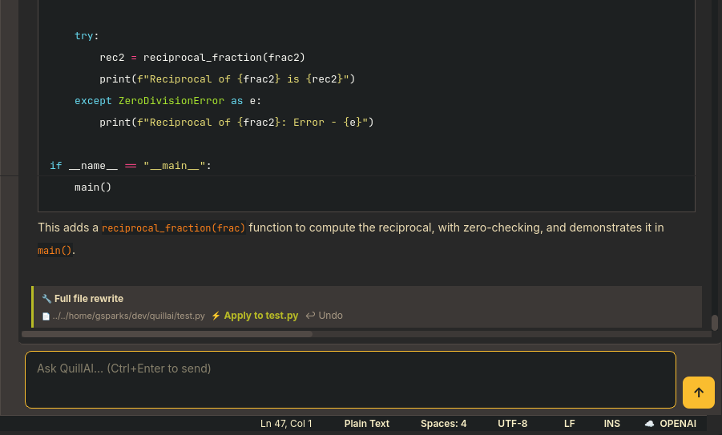

<p align="center">
  
</p>
 
<p align="center">
  
  
  
  
</p>
 
# QuillAI
 
<p align="center">
  
</p>
 
**QuillAI is an AI-powered code editor that actually understands your codebase** — not just the file you have open, but your entire project's structure, history, and conventions. Ask it about any function, class, or pattern across your whole project and get accurate answers backed by real source code, not hallucination.
 
Built with PyQt6. Runs fully local with llama.cpp or connects to Claude, GPT-4, or any OpenAI-compatible API. Your choice, switchable in one click.
 
---
 
## Why QuillAI?
 
Most AI coding tools — Copilot, Cursor, Tabnine — send your code to external servers on every keystroke. QuillAI doesn't have to. When configured with a local LLM:
 
- **Your code never leaves your machine**
- **No API keys required**
- **No usage limits, no subscription**
- **Works offline**
 
When you do want cloud power (Claude, GPT-4, OpenRouter), you switch with one click in the status bar. The choice is always yours.
 
**What makes the AI actually useful:** QuillAI builds a structured wiki of your entire codebase — every file summarized, every symbol indexed — and injects relevant pages into every prompt. Combined with a repo map, memory system, and LSP integration, the AI has genuine context about your project rather than just the file you happen to have open. It can answer "how does the auth flow work?" or "what calls this function?" accurately, because it's read the whole codebase.
 
---

## Screenshots

### Editor with Split Panes
<p align="center">
  
</p>

### Symbol Outline Panel
<p align="center">
  
</p>

### Import Graph
<p align="center">
  
</p>

### Visual CI/CD pipeline editor
 
QuillAI includes a full visual editor for GitLab CI and GitHub Actions pipelines — renders your pipeline as an interactive graph and lets you edit it without touching YAML directly.
 
<p align="center">
  
</p>
 
**Graph tab:**
- Jobs rendered as cards grouped into stage columns
- Dependency arrows drawn between jobs connected by `needs:`
- Drag a card to a different column to change its `stage:` — writes back to YAML immediately
- **Hover a card** to reveal connection ports; **drag from output port to input port** to add a `needs:` dependency
- **Right-click an arrow** to remove a dependency
- **Double-click a card** to open the inline job editor — edit name, stage, image, when, environment, allow_failure, needs, and script
- Child pipelines from `trigger:` jobs rendered as separate swimlanes
- Template jobs (`.dot-prefixed`) shown in a muted Templates swimlane with `extends:` inheritance resolved
 
**Info tab:**
- **📦 Includes** — remote project references, local includes, template includes with full path breakdown
- **🔀 Workflow rules** — every `if:` condition shown with ✓/✗ indicating when the pipeline fires, `never` rules highlighted
- **📋 Variables** — all pipeline-level variables, secrets automatically masked, CI runtime variables shown in muted style
 
All edits are surgical — only the specific lines that changed are touched. Comments, anchors, and formatting are preserved.
 
---
 
### AI self-modification
 
QuillAI can propose and apply code changes to files directly from the chat panel.
 
<p align="center">
  
</p>
 
When the AI responds with code that belongs in a specific file, an apply bar appears below the response:
 
```
🔧 Replace function search_project()
📄 ai/context_engine.py   ⚡ Apply to context_engine.py   ↩ Undo
```
 
- **Single function/class** — applied instantly using AST-precise replacement. Only the target symbol is replaced; surrounding code is untouched. Works for new functions too — appended automatically if the symbol doesn't exist yet.
- **Full file rewrite** — opens a side-by-side diff review dialog before writing anything. Accept or discard.
- **Perl subroutines** — brace-counting replacement for `sub name { ... }` blocks.
- **YAML, shell, config files** — full file replace with diff review.
- **↩ Undo** — restores the previous version instantly. One level deep.
 
Detection is automatic — no special syntax required from the AI. If a response contains a parseable function or class, the apply bar appears. For explicit control, the AI can wrap suggestions in `<file_change path="..." mode="function|full">` tags to specify the exact target.
 
After applying, the editor reloads the file automatically. The repo map is invalidated so the next chat prompt reflects the change.
 
---

## Installation

### AppImage (Linux — easiest)

Download the latest AppImage from the [Releases](../../releases) page:

```bash
chmod +x QuillAI-*.AppImage
./QuillAI-*.AppImage
```

> **NixOS users:** AppImages require `appimage-run` or system-level support.
> ```bash
> nix run nixpkgs#appimage-run -- ./QuillAI-*.AppImage
> ```
> Or add to `configuration.nix` for double-click support:
> ```nix
> programs.appimage = { enable = true; binfmt = true; };
> ```

### Nix / NixOS

```bash
# Run directly
nix run github:GSSparks/quillai

# Or install to your profile
nix profile install github:GSSparks/quillai
```

### From source

```bash
git clone https://github.com/GSSparks/quillai
cd quillai
pip install PyQt6 requests pyyaml markdown chardet
python main.py
```

For Nix development:
```bash
nix develop
python main.py
```

---

## Features

### Privacy-first AI backends
- **🏠 Local (llama.cpp)** — FIM completions via a local llama.cpp server. Zero latency, zero cost, zero data sharing. Recommended: Qwen2.5-Coder.
- **☁️ OpenAI / compatible** — any OpenAI-style API including OpenRouter, LM Studio, Ollama, and others
- **🟠 Anthropic (Claude)** — native Claude API with separate models for chat and inline completions

Switch backends at any time with the mode button in the status bar.

### Plugin system
QuillAI features a lightweight auto-discovery plugin system. Drop a new plugin folder into `plugins/features/` and it is loaded automatically on next launch — no changes to core code required.

Each plugin is a self-contained package with its own widget code and a thin `main.py` entry point:

```
plugins/features/
└── my_feature/
    ├── __init__.py
    ├── main.py          # FeaturePlugin subclass — activate(), deactivate()
    └── my_feature.py    # Widget implementation
```

Plugins communicate via a named event bus (`file_opened`, `file_saved`, `project_opened`, and more — see `EVENTS.md`). Disabling a plugin is as simple as setting `enabled = False` in its class body. The following panels are implemented as plugins:

- **Terminal** — embedded terminal dock
- **Import Graph** — dependency graph visualization
- **Symbol Outline** — LSP-powered class/method tree
- **Markdown Preview** — live preview with scroll sync

### Intent-aware inline completions
Completions are informed by your whole session — recent chat exchanges, pinned memory facts, files you've been editing, and functions you've been working in. Ghost text appears at natural pause points. **`Tab`** to accept, **`Ctrl+Right`** for word-by-word, **`Ctrl+Space`** to trigger manually.

### Project-aware AI chat
The chat panel understands your entire project: active file and the symbol you're working in, all open tabs, direct and transitive imports (up to 3 levels deep), LSP hover docs and live diagnostics, a structural repo map of the whole codebase, your wiki knowledge base, and your memory facts. Responses stream live with syntax highlighting and markdown rendering. Code blocks have a one-click copy button.

### Wiki knowledge base
QuillAI builds and maintains a structured Markdown wiki of your entire codebase, stored at `~/.config/quillai/wiki/<project>/`. Each source file gets its own wiki page containing a summary, key symbols table, intra-project dependencies, dependents, and architectural notes — generated by the AI and kept automatically up to date.

The wiki is injected into every AI prompt as structured context, giving the model a permanent, always-current understanding of your codebase without the token cost of sending raw source files.

**How it stays current:**
- **Background indexer** — on project open, a daemon thread quietly works through all unindexed or stale files one at a time, making one API call per file. You'll see `Wiki: indexed <file>` in the status bar as it progresses. It goes idle when everything is up to date.
- **On file open** — opening a file in the editor immediately queues it for indexing if its page is missing or stale, so the files you're actively working in are always prioritised.
- **On git commit** — the watcher detects every commit and reprioritises the changed files in the indexer queue.

**Wiki menu** (`Wiki` in the menu bar):
- **Update Stale Pages** (`Ctrl+Shift+U`) — triggers an immediate rescan for anything that has changed
- **Rebuild All Pages…** — clears all hashes and regenerates every page from scratch

Wiki pages are plain Markdown files — you can read them directly at `~/.config/quillai/wiki/<project>/`. An `index.md` at the top level gives a repo-level overview and module index, regenerated automatically as the wiki grows.

### LSP integration
QuillAI connects to language servers automatically when installed, giving you IDE-grade code intelligence across multiple languages:

- **Hover tooltips** — signature and docstring for any symbol, shown on mouseover with formatted markdown rendering
- **Ctrl+Click go-to-definition** — jump to where a function or class is defined, across files
- **Diagnostic squiggles** — live error and warning underlines as you type
- **Breadcrumb bar** — always-visible `file › class › method` navigation at the top of the editor; click to jump
- **Symbol outline panel** — full tree of classes, functions, and variables in the sidebar; click to jump
- **LSP completion dropdown** — context-aware completions with type signatures and docstrings
- **Context-aware chat** — LSP hover info and diagnostics are automatically injected into every chat prompt

Supported servers (all included in the Nix package):

| Language | Server |
|---|---|
| Python | `python-lsp-server` |
| YAML / Ansible | `yaml-language-server` |
| JavaScript / TypeScript | `typescript-language-server` |
| Bash / Shell | `bash-language-server` |
| HTML / CSS / JSON / Markdown | `vscode-langservers-extracted` |
| Nix | `nil` |
| Lua | `lua-language-server` |
| Perl | `perlnavigator` |

LSP degrades gracefully — everything works normally if a server is not installed.

### Split editor panes
Split the editor horizontally or vertically to view multiple files side by side. Each pane has its own tab bar and active indicator. Panes collapse automatically when their last tab is closed.

- **`Ctrl+\`** — split active pane side by side
- **`Ctrl+Shift+\`** — split active pane top/bottom
- **`Ctrl+Shift+W`** — close active pane
- **`Ctrl+K Left/Right`** — move focus between panes

### Import dependency graph
Visualize your project's import structure as an interactive force-directed graph. Node size reflects connectivity. Double-click any node to open that file. Drag nodes, scroll to zoom, pan by dragging the background. Filter low-connectivity nodes with the min-degree slider.

Supports Python, JavaScript/TypeScript, YAML, Nix, Bash, Lua, and Perl.

### Symbol outline panel
A sidebar tree of every class, function, and variable in the current file, powered by LSP `documentSymbol`. Classes nest their methods. Click any symbol to jump directly to its definition. Updates live as you edit with a 1.5s debounce.

### Repo map
QuillAI builds a structural map of your entire project on open — every file, every class, every function signature and docstring — and injects a query-filtered slice of it into every chat prompt. The model gets a navigational overview of the whole codebase without the token cost of full source. Ansible playbooks and role imports are followed and included.

The map is built in a background thread on project open, invalidated on file save, and filtered per-query so only structurally relevant files are included.

### Memory system
QuillAI remembers things across sessions:
- **Global facts** — preferences that apply to all your work
- **Project facts** — things specific to the current codebase
- **Conversation history** — past exchanges, searchable, clickable to restore
- **Turn buffer** — recent messages are always included verbatim so the AI has genuine conversational continuity within a session, not just summaries

Facts are auto-extracted from your chat messages. Everything is stored locally at `~/.config/quillai/`.

### Multi-cursor editing
Full multi-cursor support — every keystroke, deletion, and paste applies to all cursors simultaneously with atomic undo:

- **`Ctrl+D`** — add cursor at next occurrence of selected word (press again to step through)
- **`Ctrl+Shift+L`** — add cursors at all occurrences in the file
- **`Ctrl+Alt+Up/Down`** — add cursor on line above/below (column mode)
- **`Alt+Click`** — add cursor at any position (click again to remove)
- **`Escape`** — clear all secondary cursors, return to single cursor

### Crash recovery
QuillAI autosaves every 2 minutes to `~/.config/quillai/autosave/`. If the app crashes, your work is silently restored on next launch — no dialog, no friction. Recovered tabs are marked with ↩ in their title until saved. On clean exit, autosave files are removed automatically.

### Command palette
**`Ctrl+P`** — fuzzy search across open tabs, all project files, and editor actions in a unified list. Arrow keys or Tab to navigate, Enter to open, Esc to dismiss.

### Embedded terminal
**`Ctrl+\``** — toggle a full terminal docked at the bottom. Uses `qtermwidget` for a full PTY experience when available, with a QProcess-driven interactive shell as fallback. Working directory follows the open project automatically.

### Session management
Each project remembers which files you had open and where your cursor was. Switching projects restores that project's tabs, chat history, and memory. Recent Projects menu with tab count for each entry.

### Editor
- Syntax highlighting for Python, HTML, Ansible/YAML, Nix, Bash, Markdown, Perl, and more
- Line numbers with live git diff indicators (green = added, amber = modified)
- Double-click line number to select the entire line
- Minimap with click-to-navigate and viewport highlight
- Smooth scrolling with ease-out animation
- Git blame in the gutter — toggle per-file to see commit hash and author per line
- Bracket match highlighting
- Indent guides, auto-closing brackets, smart auto-indent
- Color swatch inline for hex color values — click to open color picker
- `Ctrl+E` — AI rewrite of selection with side-by-side diff preview
- `Ctrl+I` — inline chat popup at the cursor
- `Ctrl+G` — jump to line, `Ctrl+Shift+D` — duplicate line, `Ctrl+/` — toggle comment

### Sliding panel
Chat and Memory live in a sliding panel on the right edge. Hover to expand, pin to keep open, drag the left edge to resize. Width persists across sessions.

### Markdown preview
Opens automatically when editing `.md` files. Live preview with full CommonMark support. Scroll position syncs with the editor cursor — the preview follows as you move through the document. Floatable — drag it wherever you want on screen.

### Source control (Git)
Changed files tree, selective staging with checkboxes, inline diff viewer, commit/push/discard — plus AI-generated commit messages from your staged diff.

### Find & Replace / Find in Files
- **`Ctrl+F`** — live find/replace with match count
- **`Ctrl+Shift+F`** — search across the entire project

### Run & Debug
**`F5`** — run the current Python script. Output panel with stdout/stderr and a **💡 Explain Error** button that sends the traceback to the AI chat.

### Snippet palette
**`Ctrl+Shift+Space`** — fuzzy search across built-in snippets for Python, Ansible, Nix, and Bash. User-editable at `~/.config/quillai/snippets.json`.

---

## Local LLM setup

**llama.cpp:**
```bash
./server -m your-model.gguf --port 11434 -c 8192
```

Then in QuillAI settings (`Ctrl+,`):
- Server URL: `http://localhost:11434/v1/chat/completions`

**Recommended models:**
- Chat: `Qwen2.5-Coder-32B-Q4_K_M` (32GB VRAM) or `Qwen2.5-Coder-7B-Q4_K_M` (8GB VRAM)
- Inline completions: any FIM-capable model, 7B or smaller for low latency

---

## Configuration

Open **File → Settings** (`Ctrl+,`):

| Section | Setting | Description |
|---|---|---|
| Local LLM | Server URL | llama.cpp or compatible endpoint |
| Local LLM | Inline model | Fast model for ghost text |
| Local LLM | Chat model | Larger model for chat |
| OpenAI | API URL | Defaults to `api.openai.com` |
| OpenAI | API Key | `sk-...` |
| OpenAI | Chat model | e.g. `gpt-4o` |
| Anthropic | API Key | `sk-ant-...` |
| Anthropic | Chat model | e.g. `claude-sonnet-4-6` |
| Anthropic | Inline model | e.g. `claude-haiku-4-5-20251001` |

All settings stored locally at `~/.config/quillai/settings.json`.

---

## Keybindings

| Key | Action |
|---|---|
| `Ctrl+P` | Command palette |
| `Ctrl+Space` | Trigger inline AI completion |
| `Tab` | Accept full ghost text suggestion |
| `Ctrl+Right` | Accept next word of suggestion |
| `Ctrl+Shift+Space` | Open snippet palette |
| `Ctrl+E` | AI rewrite of selection (with diff preview) |
| `Ctrl+I` | Inline chat at cursor |
| `Ctrl+Click` | Go to definition (LSP) |
| `Ctrl+Return` | Send chat message |
| `Ctrl+\`` | Toggle terminal |
| `Ctrl+\` | Split editor pane (side by side) |
| `Ctrl+Shift+\` | Split editor pane (top/bottom) |
| `Ctrl+Shift+W` | Close active pane |
| `Ctrl+K Left/Right` | Focus adjacent pane |
| `Ctrl+D` | Multi-cursor: add next occurrence |
| `Ctrl+Shift+L` | Multi-cursor: add all occurrences |
| `Ctrl+Alt+Up/Down` | Multi-cursor: add cursor above/below |
| `Alt+Click` | Multi-cursor: add cursor at position |
| `Escape` | Clear secondary cursors |
| `Ctrl+G` | Go to line |
| `Ctrl+Shift+D` | Duplicate line or selection |
| `Ctrl+/` | Toggle comment |
| `Ctrl+]` | Indent selection |
| `Ctrl+[` | Unindent selection |
| `Ctrl+F` | Find / replace |
| `Ctrl+H` | Find / replace (focus replace field) |
| `Ctrl+Shift+F` | Find in files |
| `Ctrl+Shift+U` | Update stale wiki pages |
| `Ctrl+N` | New tab |
| `Ctrl+Shift+N` | New project |
| `Ctrl+O` | Open file |
| `Ctrl+S` | Save |
| `Ctrl+Shift+S` | Save as |
| `Ctrl+,` | Settings |
| `F5` | Run script |

---

## Requirements

```
Python 3.10+
PyQt6
requests
markdown
pygments
```

Optional but recommended:
```
pyyaml                 # YAML/Ansible linting
chardet                # Encoding detection
python-lsp-server      # LSP for Python
pyqtermwidget          # Full PTY terminal (Linux/macOS)
shellcheck             # Bash linting (via system package manager)
perlnavigator          # LSP for Perl
```

---

## Project structure

```
quillai/
├── main.py                        # Main window and application entry point
├── EVENTS.md                      # Plugin event bus reference
├── ai/
│   ├── worker.py                  # AIWorker — all LLM backends and streaming
│   ├── context_engine.py          # Context assembly — symbols, imports, LSP, repo map, wiki
│   ├── lsp_client.py              # Generic JSON-RPC LSP client
│   ├── lsp_manager.py             # Multi-server LSP registry and routing
│   ├── lsp_context.py             # Formats LSP hover/diagnostics for chat context
│   ├── repo_map.py                # AST-based structural project map (Python + Ansible)
│   └── embedder.py                # Embedding router (local sentence-transformers / OpenAI)
├── core/
│   ├── plugin_base.py             # FeaturePlugin ABC — activate(), deactivate(), event helpers
│   ├── plugin_manager.py          # Auto-discovery, loading, event bus, dock registry
│   ├── events.py                  # Named constants for all plugin bus events
│   ├── wiki_manager.py            # Wiki filing system — pages, hashes, dependencies, index
│   ├── wiki_generator.py          # LLM prompt → Markdown wiki page
│   ├── wiki_indexer.py            # Background daemon thread — crawls repo, processes stale files
│   ├── wiki_watcher.py            # Git commit watcher — prioritises changed files in indexer
│   └── wiki_context_builder.py    # Assembles wiki context for AI prompts
├── editor/
│   ├── ghost_editor.py            # Editor with ghost text, minimap, inline chat, LSP
│   ├── multi_cursor.py            # Multi-cursor editing logic
│   └── highlighter.py             # Syntax highlighter registry
├── plugins/
│   ├── languages/                 # Per-language syntax highlighting plugins
│   │   ├── python_plugin.py
│   │   ├── javascript_plugin.py
│   │   ├── typescript_plugin.py
│   │   ├── bash_plugin.py
│   │   ├── html_plugin.py
│   │   ├── markdown_plugin.py
│   │   ├── nix_plugin.py
│   │   ├── ansible_plugin.py
│   │   └── perl_plugin.py
│   ├── features/                  # Auto-discovered feature plugins
│   │   ├── terminal/              # Embedded terminal dock (Ctrl+`)
│   │   │   ├── main.py            #   TerminalPlugin
│   │   │   └── terminal.py        #   TerminalDock, FallbackTerminal, QtermWidget
│   │   ├── import_graph/          # Import dependency graph visualization
│   │   │   ├── main.py            #   ImportGraphPlugin
│   │   │   └── import_graph.py    #   GraphDockWidget, GraphCanvas, force simulation
│   │   ├── symbol_outline/        # LSP-powered symbol outline panel
│   │   │   ├── main.py            #   SymbolOutlinePlugin
│   │   │   └── symbol_outline.py  #   SymbolOutlineDock
│   │   └── markdown_preview/      # Live markdown preview with scroll sync
│   │       ├── main.py            #   MarkdownPreviewPlugin
│   │       └── markdown_preview.py #  MarkdownPreviewDock
│   └── themes/                    # Theme definitions
│       ├── gruvbox_dark.py
│       ├── vscode_dark.py
│       ├── monokai.py
│       ├── solarized_dark.py
│       ├── solarized_light.py
│       ├── dracula.py
│       ├── nord.py
│       ├── one_dark.py
│       ├── palenight.py
│       └── quillai.py
└── ui/
    ├── menu.py                    # Application menus and recent projects
    ├── chat_renderer.py           # Chat rendering, streaming, syntax highlighting
    ├── command_palette.py         # Ctrl+P command palette
    ├── lsp_editor.py              # LspEditorMixin — hover, go-to-def, squiggles, completions
    ├── breadcrumb_bar.py          # File › class › method breadcrumb navigation
    ├── completion_popup.py        # LSP completion dropdown with docstring preview
    ├── split_container.py         # Split editor pane container
    ├── sliding_chat_panel.py      # Sliding panel with Chat and Memory tabs
    ├── memory_manager.py          # Per-project memory, facts, conversations, turns
    ├── memory_panel.py            # Memory panel UI
    ├── git_panel.py               # Source control panel
    ├── autosave_manager.py        # Crash recovery and periodic autosave
    ├── startup_progress.py        # Animated startup indicator
    ├── session_manager.py         # Per-project tab session save/restore
    ├── find_replace.py            # Find/replace panel
    ├── find_in_files.py           # Project-wide search
    ├── snippet_palette.py         # Snippet palette
    ├── settings_manager.py        # Settings persistence
    ├── settings_dialog.py         # Settings UI
    ├── diff_apply_dialog.py       # AI rewrite diff preview
    └── theme.py                   # Theme engine — stylesheet builders for all widgets
```

### Writing a plugin

Create a folder under `plugins/features/` with a `main.py` containing a `FeaturePlugin` subclass:

```python
from core.plugin_base import FeaturePlugin
from core.events import EVT_FILE_OPENED
from PyQt6.QtCore import Qt

class MyPlugin(FeaturePlugin):
    name = "my_plugin"
    enabled = True

    def activate(self):
        from plugins.features.my_plugin.my_widget import MyDockWidget
        self.dock = MyDockWidget(self.app)
        self.app.my_dock = self.dock
        self.app.addDockWidget(Qt.DockWidgetArea.RightDockWidgetArea, self.dock)
        self.app.plugin_manager.register_dock("My Panel", "my_dock")
        self.on(EVT_FILE_OPENED, self._on_file_opened)

    def _on_file_opened(self, path=None, editor=None, **kwargs):
        pass

    def deactivate(self):
        self.dock.close()
        self.app.my_dock = None
```

Restart QuillAI — the plugin is discovered and loaded automatically. See `EVENTS.md` for the full event reference.

---

## Data & privacy

All user data is stored locally:

| Data | Location |
|---|---|
| Settings | `~/.config/quillai/settings.json` |
| Memory & facts | `~/.config/quillai/memory/` |
| Chat history | `~/.config/quillai/memory/chat_*.html` |
| Sessions | `~/.config/quillai/sessions/` |
| Snippets | `~/.config/quillai/snippets.json` |
| Wiki knowledge base | `~/.config/quillai/wiki/` |
| Autosave | `~/.config/quillai/autosave/` |

When using a local backend, no data is transmitted anywhere. When using a cloud backend, only the content you explicitly send is transmitted to that provider — nothing else.

---

## Roadmap

### Planned
- [ ] Code folding
- [ ] AI completion popup (Ctrl+Space for non-LSP files)
- [ ] Drag-and-drop tabs between split panes
- [ ] Git diff context in chat — auto-inject recent changes for debug queries
- [ ] Terminal stderr capture — pipe last error into chat context automatically
- [ ] Completion feedback loop — use acceptance data to influence suggestion ranking
- [ ] Plugin settings UI — enable/disable plugins at runtime from Settings dialog
- [ ] Wiki FAQ system — conversational knowledge layer built alongside the wiki

### Completed
- [x] Wiki knowledge base — per-project Markdown wiki auto-generated and kept current in the background; injected into every AI prompt as structured codebase context
- [x] Plugin system — auto-discovery, event bus, dock registry; terminal, import graph, symbol outline, and markdown preview all implemented as plugins
- [x] Split editor panes — horizontal and vertical, auto-collapse on last tab close
- [x] Symbol outline panel — LSP-powered class/method tree with click-to-jump
- [x] Import dependency graph — interactive force-directed visualization
- [x] LSP completion dropdown — type signatures, docstrings, kind icons
- [x] Breadcrumb bar — file › class › method navigation with symbol picker
- [x] Markdown preview scroll sync — preview follows editor cursor and scroll position
- [x] Smooth scrolling — ease-out wheel scroll animation
- [x] Perl support — syntax highlighting, linting, LSP via perlnavigator
- [x] LSP hover tooltips — formatted markdown with code block rendering
- [x] Multi-cursor editing — Ctrl+D, Ctrl+Shift+L, Ctrl+Alt+Up/Down, Alt+Click
- [x] Crash recovery — autosave every 2 minutes, silent restore on next launch
- [x] LSP support — hover docs, Ctrl+Click go-to-definition, diagnostics, 8 languages
- [x] Repo map — structural project index for codebase-aware chat
- [x] Git blame in gutter
- [x] Bracket match highlight
- [x] Embedded terminal
- [x] Command palette (Ctrl+P)
- [x] Memory system with turn buffer and session continuity
- [x] Line number double-click to select line
- [x] LSP rename symbol
- [x] Visual CI/CD pipeline editor — interactive graph for GitLab CI and GitHub Actions; drag-to-change-stage, visual needs wiring, inline job editor, child pipeline swimlanes, includes/workflow/variables info tab
- [x] AI self-modification — apply bar in chat for AST-precise function replacement, full file diff review, Perl sub replacement, one-level undo, automatic editor reload

---

## License

MIT